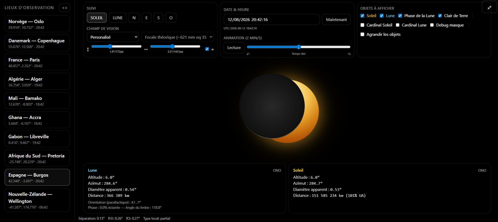

# MoonTracker

MoonTracker is an interactive web app to visualize the positions, phases, and orientations of the Moon and the Sun in the sky from various locations. Built with React, TypeScript, and Vite, it leverages accurate astronomical computations to provide a dynamic, educational experience.

## Features

- Moon phases: current phase with realistic rendering (NASA imagery + SVG masks for crescents, gibbous, and half-moon shapes).
- Sun & Moon tracking: altitude and azimuth for any date/time/location, projected onto a simulated sky stage.
- Location selection: choose from a list of world cities to instantly update the sky view and data.
- Follow modes: center the view on the Sun, the Moon, or the cardinal directions (N, E, S, W).
- Animation controls: animate time to watch the Sun and Moon move; adjust speed and pause/resume.
- Phase geometry: illuminated limb orientation computed correctly, including parallactic angle and bright limb direction.
- Earthshine simulation: optional faint glow on the dark side of the Moon.
- Cardinal overlays: show N/E/S/W markers on the Sun and Moon for orientation.
- Responsive UI: desktop and mobile friendly, dark themed.
- Telemetry cards: live numerical data for Sun and Moon (altitude, azimuth, phase fraction, orientation).

## Technical details

- Astronomy engine: the app uses astronomy-engine via a thin wrapper to obtain topocentric ephemerides with high accuracy.
  - Wrapper: `src/astro/aeInterop.ts`
    - `getSunAltAzDeg(date, lat, lng)` → `{ altDeg, azDeg, distAU }`
    - `getMoonAltAzDeg(date, lat, lng)` → `{ altDeg, azDeg, distanceKm }`
    - `getMoonIllumination(date)` → `{ fraction, phase, angleDeg }`
- Distances and apparent diameters:
  - Sun: `src/astro/sun.ts`
    - `sunDistanceAU(date)` uses `Equator(Body.Sun)` (distance in AU)
    - `sunApparentDiameterDeg(date, distAU?)` → `2·atan2(Rsun, distKm)`
  - Moon: `src/astro/moon.ts`
    - `moonApparentDiameterDeg(distanceKm)` → `2·atan2(Rmoon, distanceKm)`
- Time reference: UTC
  - A single UTC timestamp (`whenMs`) drives all animation and astronomy. The UI shows local time derived from `whenMs` for the selected location.
  - Time zone conversions: `src/utils/tz.ts`
    - `zonedLocalToUtcMs("YYYY-MM-DDTHH:mm:ss", timeZone)` → UTC ms
    - `utcMsToZonedLocalString(msUTC, timeZone)` → local string "YYYY-MM-DDTHH:mm:ss"
  - This avoids DST glitches (e.g., fall-back 03:00 → 02:00 loops).
- Projection & rendering
  - `src/render/projection.ts` uses equirectangular projection for wide FOV and gnomonic for FOV ≤ 30°.
  - Returns local px/deg scales to render realistic sizes at narrow FOV.
  - Optional “Enlarge objects” mode; otherwise apparent sizes are used.
- Eclipse diagnostics
  - `src/astro/eclipse.ts`
    - `sepDeg(alt1, az1, alt2, az2)` → angular separation (deg)
    - `eclipseKind(sep, rSun, rMoon)` → `none | partial | annular | total`
  - Displayed in the bottom panel for quick validation.

## Getting started

1) Clone the repo

```sh
git clone https://github.com/antoine-paris/moontracker.git
cd moontracker
```

2) Install dependencies

```sh
npm install
```

3) Start the dev server

```sh
npm run dev
```

4) Open http://localhost:5173 in your browser

## Technologies used

- React
- TypeScript
- Vite
- TailwindCSS
- astronomy-engine

## Key files

- `src/App.tsx` — UI orchestration, animation timing (UTC), viewport, local↔UTC conversions.
- `src/components/layout/TopBar.tsx` — local date input, UTC info display.
- `src/components/stage/*` — sprites and overlays.
- `src/astro/*` — astronomy wrappers and helpers.

## Scripts

- `dev`: vite
- `build`: `tsc -b && vite build`
- `preview`: vite preview
- `lint`: eslint .

## Contributing

Contributions are welcome. Please open issues or PRs for enhancements and new features.

## License

MIT License.

