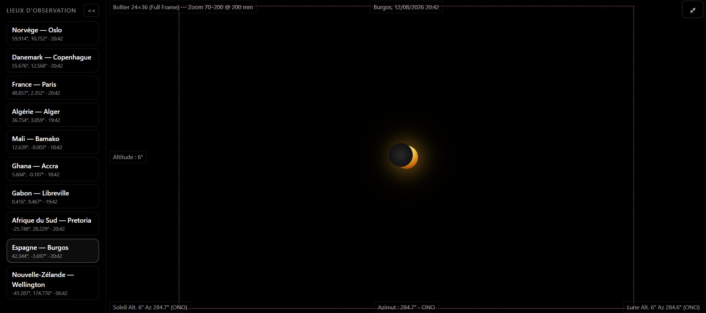

# MoonTracker

Interactive web app to visualize the positions, phases, and orientations of the Moon and the Sun from any location and time. Built with React, TypeScript, and Vite, using precise astronomical computations.

## Table of contents

- Overview
- Features (detailed)
- User guide
- How it works (technical deep-dive)
- Project structure
- Getting started
- Scripts
- Contributing
- License

## Overview

MoonTracker computes topocentric Sun/Moon positions and renders a sky stage with realistic phase geometry, apparent sizes, and optional overlays. Time is driven by a single UTC timestamp to avoid DST pitfalls. The UI is responsive and suitable for desktop and mobile.

## Features (detailed)

- Moon phase rendering
  - Current phase fraction with realistic disk rendering (NASA albedo imagery + SVG masks for crescents, quarters, gibbous).
  - Bright limb orientation computed from the solar direction and parallactic angle; waxing/waning handled correctly.
  - Optional earthshine adds a faint glow on the dark side of the Moon.
- Sun & Moon tracking
  - Altitude and azimuth for any date/time/location, updated live during animation.
  - Separation angle between Sun and Moon for quick situational awareness.
- Location selection
  - Choose among built-in world cities; sky view and local clock update instantly.
  - UI shows local time while the simulation runs internally in UTC.
- Time and animation controls
  - Play/pause with adjustable speed multipliers.
  - Jump to a specific date/time; scrub time to see diurnal motion.
  - Follow modes: center the view on the Sun, the Moon, or fixed cardinal frame (N/E/S/W).
- Stage and overlays
  - Cardinal overlays (N, E, S, W) for both the stage and object-aligned markers for orientation.
  - Field of View (FOV) aware rendering: equirectangular for wide FOV; gnomonic for FOV ≤ 30°.
  - Optional “Enlarge objects” mode; otherwise apparent angular sizes are respected.
- Telemetry cards
  - Live numerical data for Sun and Moon: altitude, azimuth, phase fraction, bright limb angle, and apparent diameters.
- Eclipse diagnostics (quick-look)
  - Classifies configuration as none | partial | annular | total based on separation and apparent radii.
- Responsive UI
  - Dark-themed layout adapted for desktop and mobile.

## User guide

1) Select a location (city) to set latitude/longitude and local time zone.
2) Pick a date and local time; the app converts this to UTC internally.
3) Start animation to watch the Sun and Moon traverse the sky; adjust speed as needed.
4) Toggle follow mode (Sun/Moon) to keep the selected body centered.
5) Use overlays (cardinals, limb orientation) and earthshine to aid visual interpretation.
6) Adjust FOV; enable “Enlarge objects” for visibility at very wide angles.

## How it works (technical deep-dive)

- Astronomy engine wrapper
  - Thin wrapper around astronomy-engine exposes high-level helpers in `src/astro/aeInterop.ts`:
    - `getSunAltAzDeg(date, lat, lng)` → `{ altDeg, azDeg, distAU }`
    - `getMoonAltAzDeg(date, lat, lng)` → `{ altDeg, azDeg, distanceKm }`
    - `getMoonIllumination(date)` → `{ fraction, phase, angleDeg }`
- Apparent sizes and distances
  - Sun helpers in `src/astro/sun.ts`:
    - `sunDistanceAU(date)` via `Equator(Body.Sun)` (AU)
    - `sunApparentDiameterDeg(date, distAU?)` → `2 · atan2(Rsun, distKm)`
  - Moon helpers in `src/astro/moon.ts`:
    - `moonApparentDiameterDeg(distanceKm)` → `2 · atan2(Rmoon, distanceKm)`
- Time model
  - Single UTC timestamp `whenMs` drives the simulation and rendering.
  - Local time in the UI is derived from UTC using `src/utils/tz.ts`:
    - `zonedLocalToUtcMs("YYYY-MM-DDTHH:mm:ss", timeZone)`
    - `utcMsToZonedLocalString(msUTC, timeZone)`
  - This avoids DST edge cases (e.g., fall-back 03:00 → 02:00 loops).
- Projection and rendering
  - `src/render/projection.ts`: equirectangular for wide FOV, gnomonic for FOV ≤ 30°.
  - Returns local px/deg scales so that apparent sizes remain physically consistent at narrow FOVs.
  - Rendering pipeline composes sprites/overlays from `src/components/stage/*`.
- Eclipse diagnostics
  - `src/astro/eclipse.ts`:
    - `sepDeg(alt1, az1, alt2, az2)` → angular separation (deg)
    - `eclipseKind(sep, rSun, rMoon)` → `none | partial | annular | total`
- UI orchestration
  - `src/App.tsx` coordinates animation timing (UTC), viewport state, and local↔UTC conversions.
  - `src/components/layout/TopBar.tsx` provides date/time inputs and UTC info display.

## Project structure

- src/
  - App.tsx — UI orchestration, animation clock, viewport, time conversions
  - astro/
    - aeInterop.ts — topocentric Sun/Moon and illumination helpers
    - sun.ts — Sun distances and apparent diameter
    - moon.ts — Moon apparent diameter and helpers
    - eclipse.ts — separation and eclipse kind helpers
  - render/
    - projection.ts — equirectangular and gnomonic projections, FOV handling
  - components/
    - layout/TopBar.tsx — local date/time input, UTC display
    - stage/* — sprites, overlays, and sky rendering pieces
  - utils/
    - tz.ts — timezone conversions, local↔UTC helpers

## Getting started

1) Clone the repo

```sh
git clone https://github.com/antoine-paris/moontracker.git
cd moontracker
```

2) Install dependencies

```sh
npm install
```

3) Start the dev server

```sh
npm run dev
```

4) Open http://localhost:5173 in your browser

## Scripts

- dev: vite
- build: tsc - b && vite build
- preview: vite preview
- lint: eslint .

## Contributing

Contributions are welcome. Please open issues or PRs for enhancements and new features.

## License

MIT License.

